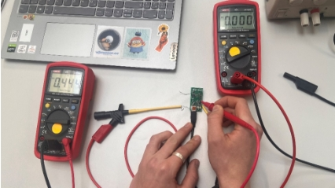

HWE-ÜbungenOtto Cibulka, Niko Leimegger4CHEL 2022/23

Mini-Powerbank    k           Otto Cibulka/5, Niko Leimegger/11

# Inhalt
[Aufgabenstellung:	3](#_Toc120043920)

[Lithium-Ionen:	3](#_Toc120043921)

[Blockschaltbild:	3](#_Toc120043922)

[Systembeschreibung:	4](#_Toc120043923)

[Schaltplan:	4](#_Toc120043924)

[Board	5](#_Toc120043925)

[Dimensionierung der Bauteile:	5](#_Toc120043926)

[LEDs:	5](#_Toc120043927)

[LDK220:	5](#_Toc120043928)

[MAX682:	5](#_Toc120043929)

[Bestücken	6](#_Toc120043930)

[25.10.2022	6](#_Toc120043931)

[Fehler und Schwierigkeiten:	7](#_Toc120043932)

[Gehäuse CAD	8](#_Toc120043933)

[Version 1	8](#_Toc120043934)

[Version 2	9](#_Toc120043935)

[Messungen	10](#_Toc120043936)

[Erster Messaufbau:	10](#_Toc120043937)

[Zweiter Messaufbau:	10](#_Toc120043938)

[Schutz-IC Funktion messen.	10](#_Toc120043939)

[Konklusion:	10](#_Toc120043940)

## Aufgabenstellung:
Ziel des Projektes war es, eine Schaltung für eine Lade und Entlade-station für einzelne Li-Ion Zellen zu designen. Um das Umzusetzen, mussten wir ICs suchen, die Schaltung aufbauen, die Platine routen, bestellen und bestücken und zuletzt die Schaltung messen und in ein selbstgemachtes Gehäuse einzubauen. Das Ziel ist es eine Li-Ionen Zelle geregelt zu laden. Dabei sollte sie sich nicht tiefenentladen und nicht überladen. Außerdem sollte sie gegen Kurzschluss und Überspannung gesichert sein. Am ausgang sollten wir nach zu 5V und 3,3V haben.

Lithium-Ionen:
Da eine Lithium-Ionen-Zelle der hauptkerne unseres Projekts ist werden wir hier kurz die Grundinformationen zusammenfassen.

Die Li-Ion Akkus haben eine Spannung von 4.2V – 2.7V und 2800mAh. 

Da Lithium-Ionen-Zelle bei einer Spannung von unter 2.7V und über 4.2V kaputt gehen. Müssen der lade und entlade Vorgang sehr geregelt ablaufen. Und genau in diesem Punkt kommt unsere Schaltung zum Einsatz.

*Abbildung 1: Bild der gegebenen Li-Ion Zellen*

Genaue Angaben:

Die Schaltung muss wie oben erwähnt die Zell geregelt Laden und entladen. Außerdem sollten wir die Batterie Spannung auf 3.3V und 5V Regeln.

In der Schule haben wir schon 3 ICs, um die Akkus zu laden und 3,3 und 5V Ausgangs Spannung zu erzielen. Den Schutz IC mussten wir selbst suchen.
## Blockschaltbild:

*Abbildung 2: Blockschaltbild unserer Schaltung*
## Systembeschreibung:
Unsere Schaltung lässt sich in zwei Teile ein Teilen, der Teil, der die Batterie überwacht und ladet und der Teil, der die Batterie Spannung auf konstante 3,3V und 5V regelt.
## Schaltplan:
Unsere Schaltung wird mit mini-USB versorgt. Damit wird der Lade IC ( Schwarz - BQ21040) versorgt, der die Batterie ladet. Die Batterie versorgt dann den Schutz-IC ( Gelb - FS312F-G) und die ICs für eine konstante Ausgangs Spannung( Türkis - LDK220 für 3,3V und MAX683 für 5V - Violett). Nach unserer IC-Auswahl wird bei einer Akkuspannnung von ca. 2,8V abgeschaltet und die Batterie wird nicht mehr entladen.

*Abbildung 3: Schaltplan mit IC in Farbe eingerahmt*

Ebenfalls haben wir noch 3 LEDs hinzugefügt die als Indikatoren dienen sollten

1. System läuft 
1. Discharge Control LED
1. Overcurrent Control LED

## Board
Unser Board sollte genau so groß sein wie die Batteriehalterung. Wegen Clearance Fehlern zwischen Halterung und Board-Rand war das jedoch nicht möglich und somit ist das Board ein bisschen größer.

*Abbildung 4: Boardlayout*
## Dimensionierung der Bauteile:
Die meisten Bauteile waren gegeben im Datenblatt bis auf 3 Widerstände und die jeweiligen Widerstände für die LEDs
### LEDs:
Die LEDs benötigen ~5mA: RLED=3,6V5mA=720Ω (E-Reihe: 750 Ω)
### LDK220:
Die Widerstände für den Spannungsteiler beim LDK220 werden wie folgt berechnet:

Vo=VADJ\*1+R1R2

Vo soll 3,3V sein und VADJ soll laut Datenblatt zwischen -0,3V und 2V liegen also haben wir uns für 1V entschieden. R1 haben wir mit 750 Ω definiert, weil wir für die LED-Widerstände auch 750 Ω benutzen und somit nicht mehr verschiedene Bauteile benötigen, und für R2 ca. 326 Ω (E-Reihe: 330 Ω) herausbekommen. 

### MAX682:
Den Eingangswiderstand für den 5V Regler IC haben wir so berechnet:

RextkΩ=45000\*Vin-0,69VfosckHz

Diese Formel stammt aus dem Datenblatt. Die Frequenz bestimmt die Frequenz der Charge Pump im IC.

Für Vin haben wir die Durchschnittsspannung von ~3,6V verwendet. fosc haben wir am niedrigeren Spektrum der maximalen Werte angesetzt. Maximal 1000kHz, minimal 200kHz. Wir haben uns für 500kHz entschieden und somit einen Widerstand von 300kΩ berechnet. 

LT-Spice bzw. Simulation

Da unsere Schaltung Hauptsächlich aus ICs besteht, können wir schwer etwas Simulieren daher legen wir mehr Wert auf das Gehäuse.  

## Bestücken
### 25.10.2022
*Abbildung 5: Bauteile auf Papier*
Die Platinen sind angekommen und wir haben angefangen zu bestücken

*Abbildung 6: Bestückung der Leiterplatte*

Bei der Bestückung gab es keine wirklichen Schwierigkeiten nach 2 Stunden waren wir fertig.

## Fehler und Schwierigkeiten:

*Abbildung 7: Nahaufnahme unserer fertigen Platine*

Wir hatten im Laufe unseres Projektes mehrere (vor allem schlampigkeits-) Fehler. Diese kamen wahrscheinlich daher, dass unsere ICs mehrmals, während der Schaltplanentwicklungsphase ausgetauscht werden mussten. Unter anderem haben wir beim 3,3V IC (LDK220) den OUT und ADJ-Pin vertauscht. Lösung: [Rot - Rechte Seite] Pins hochbiegen und mit Draht verkreuzen.

[Rot – Linke Seite] Außerdem ließen wir den ENABLE-Pin im „float“ zustand also nicht definiert. Dieser Fehler ließ sich jedoch leicht mit einem stück Draht beheben. 

[Blau] Dasselbe Problem hatten wir mit dem Temperatur-Pin des Lade-ICs (Behoben mit Jumper auf GND)

[Pink] Ein weiterer Fehler war, dass das Package, welches wir im Schaltplan für den Mini-USB Stecker verwendet haben, nicht zur Verfügung stand.

Automatisch generierte Beschreibung](Aspose.Words.7bfafa68-95be-4650-a2fa-78456f5eb427.019.png)Lösung: Mini-USB-B Stecker verwenden und nicht gewollte Pins entfernen um mehr Platz für VCC und GND-Pin 

*Abbildung 8: nicht benutzte Pins entfernt.*

## Gehäuse CAD
### Version 1
Bei dem Gehäuse war unser Hauptpunkt das wir das ganze so simpel und klein wie möglich halten.

Dafür teilen wir unser Gehäuse in 2 Teile ein, den unteren und den oberen Teil. Somit können wir jederzeit die Platine erreichen, indem wir das untere Teil entfernen und die Batterie wechseln, indem wir das obere Teil entfernen. Die zwei Teile rasten jeweils separat am Gehäuse der Batterie ein. Der untere Teil hat eine Öffnung für den USB-Stecker und eine Einsenkung damit die LEDs durchscheinen.

*Abbildung 7/8: Bild des untern Teils 3D/Seite*

Das Oberteil benötigt keine Öffnungen dennoch haben wir eine kleine Einkerbung auf beiden Seiten erstellt, Somit sollte es leichter gehen die Teile auseinander zu ziehen.

*Abbildung 9/10: Bild des oberen Teils 3D/Seite*

Nachdem wir unsere erste Version in SolidWorks fertig gezeichnet hatten, mussten wir die STL-Datei in der passenden Software Slicen und zum Drucker senden.

Version 1 war ein bisschen zu klein und die Einkerbungen funktionierten auch nicht so wie wir es wollten. Dadurch das der Batteriehalter ein bisschen wackelte und unser gesamtes Gehäuse auf diesem aufbaute war alles eine wacklige Sache. Ebenfalls ist das Rasin des Druckers eher spröde und deshalb ungeeignet für so ein klick System wie wir es wollten. 

### Version 2
Wir brauchten einen neuen Ansatz. Da das klick System wie wir es wollten nicht funktionierte, wollten wir dieses Mal nur ein Teil verwenden.

Also der Plan war ein Teil, das wir auf die Platine klicken können. Diese sollte eine Öffnung für den USB-Port haben ebenfalls brauchen wir Löcher für die Ausgangspins für 3.3V und 5.0V. Bei dem letzten System war das Problem, dass nach wiederholtem auf und zumachen die Pins abgebrochen sind, die für das Einrasten der Teil zu ständig waren. Da wir dieses Gehäuse nur einmal draufklicken, ist das jetzt kein Problem mehr.

*Abbildung 11/12/13: Bild der 2 Version 3D/oben/Seite*

Nach dem wir es ausgedruckt hatten und auf die Platine gesteckt haben, hat alles perfekt funktioniert.

*Abbildung 9: Links finale Version, Mitte Alte Version und rechts Batterie Zelle*

##
##

## Messungen
### Erster Messaufbau: 
Stromversorgung per USB, Ladestrom und Batteriespannung mit Digital-Multimeter. Die Batterie hat 3,994V und wird mit 12,26 mA geladen

Dieser Strom ist viel zu gering unsere Vermutung ist sogar das wir die Batterie gar nicht laden, sondern, dass sich die Batterie sogar über die Schaltung entladen.

Nach dem wir ein wenig herum probiert haben hatten wir einen Lade Strom von 834mA. (Die Genau Gründe für die Fehler finden sie im Bereich der Fehler)

Nachdem die Batterie voll war, schalten die MosFets des Schutz-IC und die Batterie wird nicht mehr geladen 

Als wir unser Projekt der Klasse vorstellten hatten wir denselben Messaufbau, doch hier wurde die Batterie nur mit 253mA geladen. Wieso das so war, konnten wir auf die Schnelle nicht herausfinden.

### Zweiter Messaufbau:
Batterie wird mit Spannungsquelle simuliert, Spannung an Ausgängen mit Multimeter messen à

Unter 2,8V wird am Ausgang keine Spannung mehr gemessen à Schaltung denkt Batterie zu sehr entladen

Über 4.3 schalten die MosFets und die Batterie wird nicht mehr geladen.
### Schutz-IC Funktion messen.
Klemmen der Batterie Kurzschließen -> Strom Messen -> Gate Spannung an MosFets messen.

Links: Spannung am Gate in Volt VGate1  = 0,4 V

VGate2  = 0,8 V

Rechts oben: Strom zwischen den Klemmen in Ampere

# Konklusion:
Die Schaltung funktioniert grundsätzlich. Unser Ladestrom beträgt I = 865mA bei einer leeren Zelle und I = 0mA bei einer vollen. Der Ladevorgang ist vor Kurzschluss und Überspannung sowie tiefen Entladung geschützt und am Ausgang liegen die gewünschten Spannungen an. Natürlich kann das Projekt erweitert werden z.B. mit einem Ein-Aus Schalter, LEDs die nur an sind, wenn man einen Knopf drückt um unerwünschte Entladung der Zelle zu vermeiden, etc.
PowerbankHTL Rankweil11
